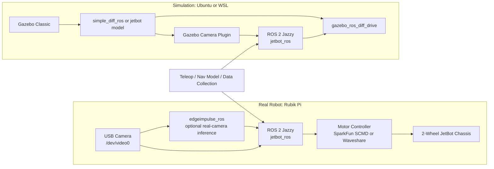

# Architecture

This repository has two distinct runtime shapes:

1. Rubik Pi real hardware bringup
2. Ubuntu or WSL Gazebo Classic simulation

The same ROS 2 package provides motors, teleop, data collection, and navigation
nodes for both.

## System Diagram

## Real Hardware Path

- `launch/jetbot_cpu.launch.py`
- motor node:
  - `motors_sparkfun`
  - or `motors_waveshare`
- USB camera through `v4l2_camera`
- optional direct USB camera inference through `edgeimpulse_ros`

Notes:

- The current validated USB camera path on Rubik Pi used `YUYV`, not `MJPG`.
- Do not run `v4l2_camera` and `edgeimpulse_ros` against the same camera device
  at the same time.

## Simulation Path

- `launch/gazebo_world.launch.py`
- `launch/gazebo_nav.launch.py`
- Gazebo Classic
- generic differential-drive model:
  - `gazebo/models/simple_diff_ros`
- generic differential-drive worlds:
  - `dirt_path_simple_diff.world`
  - `dirt_path_curves_simple_diff.world`
  - `maze_simple_diff.world`
  - `maze_obstacles_simple_diff.world`

Notes:

- Treat Gazebo as an Ubuntu or WSL development workflow, not a Rubik Pi
  onboard workflow.
- This repository has not been migrated to Gazebo Harmonic or `ros_gz_*`.

## Edge Impulse Placement

Edge Impulse integration is intentionally separated:

- `jetbot_ros_rubikpi`: robot nodes, Gazebo, motor health workflow
- `edgeimpulse-ros`: direct camera inference into ROS topics

That split keeps the camera inference stack independent from the base robot
bringup and makes it easier to reuse the same `edgeimpulse_ros` workflow across
multiple robots.
